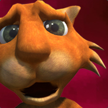
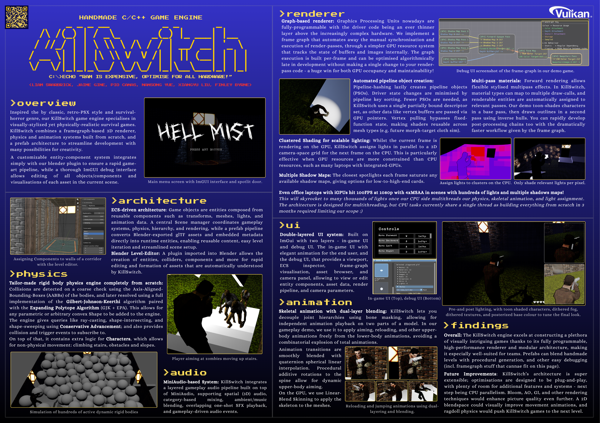

  

    
    <h1>About Me</h1>
    
Hello! I’m <b>Pío Cañas</b>, a final year student studying Computer Science with High Performance Graphics and Games Engineering at the University of Leeds.

    <h2>Contact</h2>
    <ul style="list-style-type:none;padding-left:0;">
      <li><strong>E-mail:</strong> <a href="mailto:pio.canas@gmail.com">pio.canas@gmail.com</a></li>
      <li><strong>Telephone:</strong> +44 07939883521</li>
      <li><strong>GitHub:</strong> <a href="https://github.com/piocanas" target="_blank">@piocanas</a></li>
      <li><strong>LinkedIn:</strong> <a href="https://www.linkedin.com/in/piocanastoimil/" target="_blank">linkedin.com/in/piocanastoimil</a></li>
    </ul>
    <h2>CV</h2>
    <ul style="list-style-type:none;padding-left:0;">
      <li><a href="assets/CV.pdf" target="_blank" download>Download PDF here</a></li>
    </ul>
  

  

  

  <h3>Killswitch Engine & Hellmist</h3>
  <video width="100%" controls>
    <source src="assets/killswitch-demo.mp4" type="video/mp4">
    Your browser does not support the video tag.
  </video>
  

    <b>Killswitch Engine</b> is a 3D C++ custom game engine developed as a group project, featuring component-based architecture and real-time rendering. 
    <b>Hellmist</b> is a third-person horror demo game built using the engine, showcasing forward rendering, animation, and scripted gameplay.
  

  <ul style="list-style-type: none; padding-left: 0;">
    <li>
      <a href="assets/killswitch-report.pdf" target="_blank" download>Download Full Report (PDF)</a>
    </li>
    <li>
      <a href="assets/killswitch-poster.png" target="_blank" download>Download Poster as Image</a>
    </li>
    <li>
      <button id="expandBtn" class="pretty-btn" onclick="expandPoster()">Expand Poster</button>
      <button id="collapseBtn" class="pretty-btn" style="display:none;margin-left:0;" onclick="collapsePoster()">Collapse Poster</button>
    </li>
  </ul>

  
   
  <small style="color:#666;">Click the poster to enlarge within the page.</small>

<!-- Lightbox Modal (add just before </body> or at end of index.md) -->

  &times;
  

    

      <h3>Immersive Basketball VR Experience</h3>
        <video width="100%" controls>
          <source src="assets/Gameplay.mp4" type="video/mp4">
          Your browser does not support the video tag.
        </video>
      

      A virtual reality basketball simulation developed in Unity for the Meta Quest 2, focused on creating realistic and immersive shooting mechanics. The project uses physics-based ball interactions, custom shot assist systems, responsive UI, and multiple game         modes to recreate the feel of real basketball in VR. Built using the XR Interaction Toolkit and optimized for standalone VR hardware, the experience was evaluated through user testing, achieving strong results for immersion, realism, and overall enjoyment.
      

      <a href="assets/PIOCANASTOIMIL25-FINAL.pdf" target="_blank" download>Full Report (PDF)</a>
    

    

      <h3>Project Three</h3>
      
third project

      <a href="#">View on GitHub</a>
    

    

      <h3>Project Four</h3>
      
Another project placeholder.

      <a href="#">View on GitHub</a>
    

  

